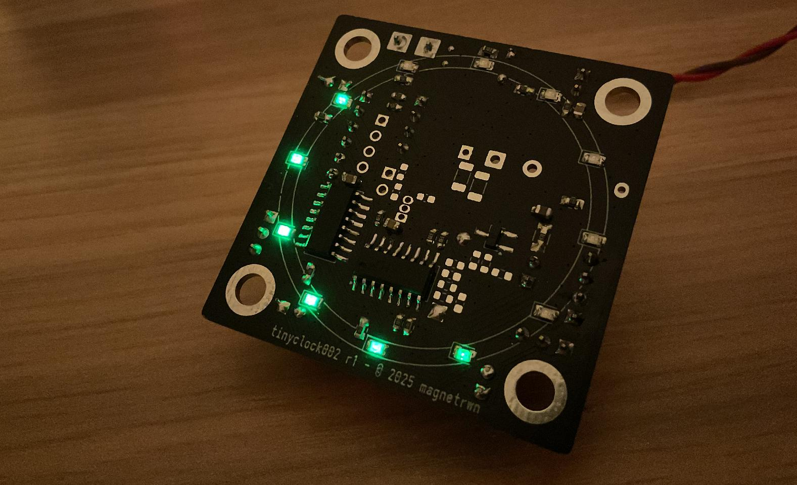

<!-- Project cover -->

  

# tinyclock002

**Note: Work in progress, mostly for my own learning and experimentation.**

A compact, simple alarm clock / time showing board built around the **CH32V002** (CH32V002A4M6, RV32EmC MCU), with a multiplexed LED grid driven through a **74HC595** chain and a **DS1302** RTC for timekeeping. The design includes headers for UART and I2C access, input through a linear potentiometer and push button (not onboard), a piezo buzzer as well as a speaker driver and header, that is currently not being tested, but is available on the board (**PAM8302AAS**).

The goal is to keep the design small (50×50mm), simple, and educational: a low-cost 2 layer RISC-V MCU board to practice PCB layout + bare-metal firmware. The final target is to be able to play MOD tracker files as an alarm sound through the speaker output, see [ModPlayRISCV](https://github.com/cpldcpu/ModPlayRISCV).

## Design files

The design files are available in the `/hw/` folder. The design is made in KiCad 9. Prototype boards were fabricated by PCBWay using their standard 2 layer PCB service (with matte black solder mask), while assembly was done by me.

## Limitations

The **CH32V002** MCU is limited to 4kB of RAM and 16kB of flash, which is quite tight for a clock with alarm and sound playing capabilities. The current firmware uses 3/4rs of the flash, and a small amount of RAM, which leaves very little room left without moving to heavier space optimization. It might not be possible to fit a MOD player in the remaining space while simultaneously keeping the clock and alarm functionality...

## Current measurements

Here are some rough current consumption measurements with the current demo:
- Running with LEDMUX demo: ~2.3 mA.
- CH32V002 in standby mode: ~500 µA.
Specific measurements aren't available yet. Estimations can be made based on the datasheets and idle/quiescent current figures.