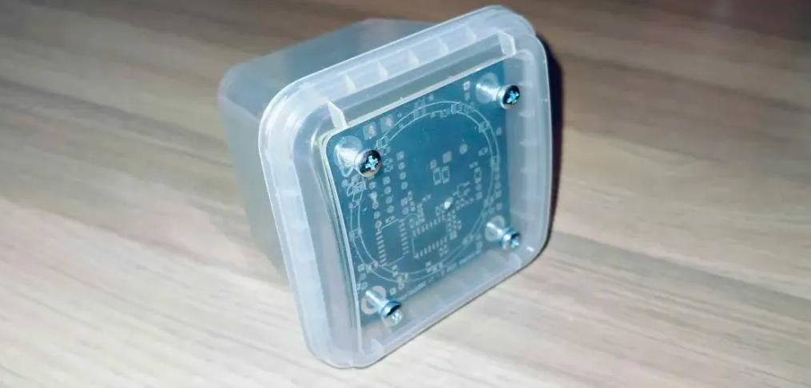

<!-- Project cover -->

  

# tinyclock002

> [!NOTE]
> Work in progress, mostly for my own learning and experimentation with WCH, may take some time to update.

A compact, simple alarm clock / time display board built around the **CH32V002** (**CH32V002A4M6**, RV32EmC MCU), with a multiplexed LED grid driven through a **74HC595** chain and a **DS1302** RTC for timekeeping.

The design includes headers for UART and I²C access, input through a linear potentiometer + push button (not onboard), a piezo buzzer, and a speaker driver/header using the **PAM8302AAS** Class-D amplifier (pretty loud for an alarm).

The goal is to keep the board small (50×50mm), simple, and educational: a low-cost 2-layer RISC-V MCU board to practice PCB layout + bare-metal firmware. The final target is to be able to play MOD tracker files as an alarm sound through the speaker output, see [**ModPlayRISCV**](https://github.com/cpldcpu/ModPlayRISCV).

## Design files

Design files are in **`/hw/`**. The project is made in **KiCad 9**.

Prototype boards were fabricated by PCBWay using their standard 2-layer service (matte black solder mask). Assembly was done by me.

For a tour of the design, you can find a schematic PDF in that same folder.

## Functionality

- The CH32V002 runs at **48 MHz**, with **4 kB RAM** and **16 kB flash**. Simple architecture, very cost-effective for the speed.
- Multiplexed LED circular display using a **74HC595** (structured as **4×3**) for showing time + simple animations while using only a few GPIOs.
- **DS1302 RTC** for timekeeping, ~~with support for setting time through UART commands~~.
  - The board allows either a **supercap** (trickle-charged by the DS1302) or a **CR2032** holder.
- UART + I²C headers for debugging and potential future expansion (not currently used in firmware).
- **Piezo buzzer** for simple alarm sounds.
- **Speaker output** driven by **PAM8302AAS** + filter network.
  - Intended for more complex audio (PCM-over-PWM using **TIM1**, eventually MOD tracker audio).
- Linear potentiometer + push button for user input (not currently used in firmware).
  - A jumper allows powering the pot either from VCC (constant small draw), or from a 74HC595-controlled line to reduce idle consumption.

## Limitations

The **CH32V002** is tight: **4 kB RAM / 16 kB flash** is not a lot for “clock + alarm + sound playback”.

Right now the firmware uses **~3/4 of flash** and a small amount of RAM. There isn’t much room left unless with heavy size optimization. It might simply not be possible to fit a MOD player while keeping all the clock/alarm features on the same MCU...

## Current measurements

With the current demo:
- Running LEDMUX demo, no audio: **2.3 mA**
- CH32V002 in standby mode: **520 µA**  
  *(TODO: IWDG might still be enabled, this number matches the typical “IWDG standby current” range.)*

With the **PAM8302AAS** speaker driver installed:
- Idle current: depends on the speaker, **~7 mA @ 5V** with an **8 Ω** speaker connected
- Driving the speaker through TIM1 PWM (50% duty): **450 mA @ 5V**  
  *(Tracks with PAM8302AAS rated maximum of 2.5 W.)*

These are still estimates for the moment, as the firmware is still in early development and not optimized for low power.

## Notes

- **PAM8302AAS /SD** (shutdown) is tied to the **AUDIO_MUTE** jumper, pulling it up to VCC in normal operation, so the amp is always enabled.
  - This can be fixed with a bodge wire to a spare GPIO output (possibly using LTHRU), but it’s not a goal right now.
  - If aiming for minimal current draw, this should be fixed.

## Images

  

  

**Video demo:** `media/running-ledmux.mp4`  